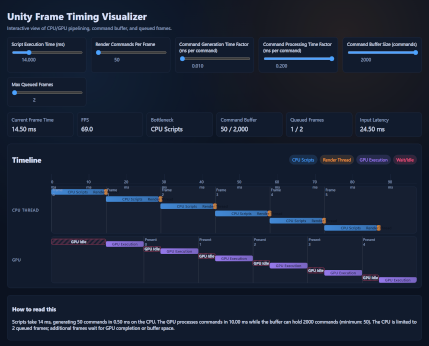

# Unity Frame Timing Visualizer

An interactive web-based visualization tool that simulates and demonstrates CPU/GPU pipelining, command buffer behavior, and frame queuing in Unity-style rendering pipelines.



## Overview

This educational tool helps developers understand the complex timing relationships between CPU and GPU work in modern game engines. By adjusting parameters in real-time, you can explore how different configurations affect frame rate, identify bottlenecks, and understand the impact of command buffer size and frame queuing limits.

## Features

- **Real-time Simulation**: Adjust parameters with sliders and see immediate visual feedback
- **Interactive Timeline**: Visual representation of CPU and GPU work across multiple frames
- **Performance Metrics**: Track FPS, frame time, bottleneck identification, buffer usage, and input latency
- **Educational**: Understand concepts like:
  - CPU-bound vs GPU-bound scenarios
  - Command buffer saturation
  - Frame queuing and input latency
  - Pipeline parallelism

## How to Use

### Running Locally

No build process or dependencies required! Simply:

```bash
git clone https://github.com/yourusername/nbrader.com-unity-frame-visualizer.git
cd nbrader.com-unity-frame-visualizer
```

Then open `index.html` in your web browser.

### Controls

- **Script Execution Time**: Duration of CPU-side game logic and physics (ms)
- **Render Commands Per Frame**: Number of draw calls/render commands generated per frame
- **Command Generation Time Factor**: CPU time per render command (ms per command)
- **Command Processing Time Factor**: GPU time per render command (ms per command)
- **Command Buffer Size**: Maximum commands that can be queued before CPU must wait
- **Max Queued Frames**: CPU frame queue depth limit (prevents excessive input latency)

### Understanding the Timeline

The timeline shows two parallel tracks:
- **CPU Thread**: Shows script execution (blue), render command generation (orange), and wait states (red stripes)
- **GPU**: Shows execution (purple) and idle/wait states (red stripes)

Each frame is labeled with "Frame N" on the CPU track and "Present N" when the GPU completes rendering.

### Reading the Metrics

- **Frame Time**: Time between frame presentations (lower is better)
- **FPS**: Frames per second
- **Bottleneck**: Identifies the limiting factor (CPU Scripts, CPU Render, GPU, Buffer Full, or Max Frames Queued)
- **Command Buffer**: Current buffer usage vs maximum capacity
- **Queued Frames**: Number of frames queued for GPU vs limit
- **Input Latency**: Time from frame start to final presentation

## Examples to Try

1. **CPU-Bound Scenario**: Increase "Script Execution Time" to 30ms while keeping GPU processing low - observe CPU bottleneck
2. **GPU-Bound Scenario**: Increase "Command Processing Time Factor" to 0.15 - observe GPU becoming the bottleneck
3. **Buffer Saturation**: Set buffer size close to render commands count - observe CPU waiting for buffer space
4. **Input Latency**: Increase "Max Queued Frames" to 6 - see how input latency grows

## Technical Details

- Pure JavaScript (no frameworks)
- No build process or dependencies
- Client-side only
- Simulates 6 frames of pipelining behavior
- Adaptive timeline axis based on simulation duration

## Project Structure

```
.
├── index.html      # DOM structure and controls
├── script.js       # Simulation engine and rendering logic
├── style.css       # Dark theme styling
├── CLAUDE.md       # Development guidance for AI assistants
└── README.md       # This file
```

## License

MIT License - see [LICENSE](LICENSE) file for details.

Copyright (c) 2025 Nathan Scott Brader

## Contributing

Contributions are welcome! Feel free to open issues or submit pull requests.